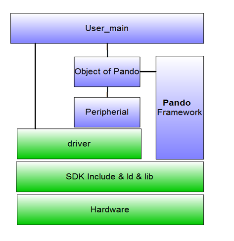
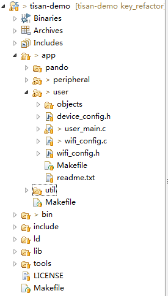
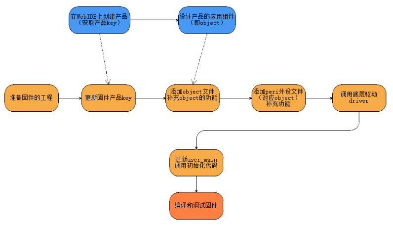

# 3 固件编程模型    
本章讲解固件编程模型和流程。  

## 3.1 固件编程模型图  
    
另外有专门管理工具类函数，在/app/util/ 目录下，存放通用的工具函数库，其他应用有需要也可以在这里编写和调用。
 
 
## 3.2 固件工程目录讲解  
固件的开发环境的介绍参考[tisan-doc](https://sw0813.gitbooks.io/tisan-doc/content/), 导入工程后，固件的目录结构如下：  
  

### 3.2.1 整体目录说明  
tisan当前固件基于esp8266的SDK，当前使用的SDK版本号为1.3.0。  目录说明：  
1. app 文件夹为用户主目录，开发者开发固件在该目录进行;  
2. bin 文件夹存放工程编译输出的固件（bin文件），/bin/upgrade 目录下输出用户固件；  
3. include 文件夹存放esp8266官方SDK的自带头文件，提供其SDK的API函数及其他定义，用户无需修改；  
4. ld 文件夹存放esp8266官方SDK链接时需要的文件；  
5. lib 文件夹存放esp8266官方SDK编译时所需要的库文件；
6. tools 文件夹存放身材bin文件所需的工具。  

工程编译生成固件由makefile脚本生成，无须再用cygwin。
> 默认生成固件的配置在最外面的makefile脚本里面，默认的SPI_SPEED是40（MHz），SPI_MODE是QIO，等，如果需要更改配置请到最外层的makefile里面进行修改。  

### 3.2.2 app 目录说明  
app文件夹为用户主目录，开发框架也在该目录下。  
1. pando 文件夹为pando框架的目录，里面存放网关（gateway）、协议（protocol）等文件，用户无需修改。  
2. peripheral 文件夹存放外设和驱动（driver，该目录下的文件与ESP8266是管脚资源相关）文件；  
3. user 文件夹存放用户入口文件user_main.c、网络配置文件wifi_config.c、设备配置文件device_config.h，以及用户设计添加的object。  
4. util 文件夹存放通用的工具函数文件。  

## 3.3 基于开发框架的固件开发流程  
固件开发需要结合WebIDE进行，WebIDE创建产品和设计组件后要保存才有效。流程如下：  
   

> 在/app/user/ 目录下的device_config.h下更新产品key。  
> 在/app/user/objects/ 目录下增加设计的新object文件。  
> 在/app/peripheral/ 目录下管理外设文件。  
> 如果需要对driver进行编写，可以参考芯片编程手册：[ESP8266编程手册](http://bbs.espressif.com/download/file.php?id=987)，和相关的外设资料进行编写。

