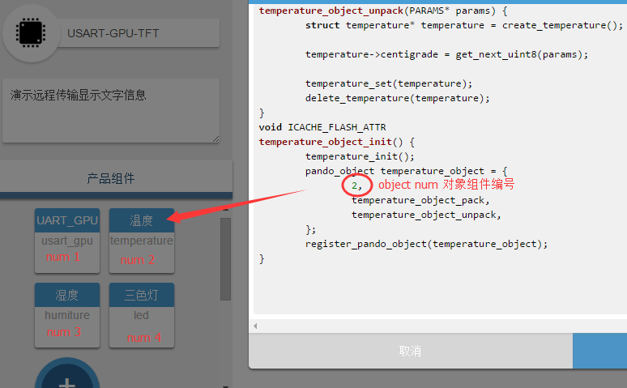

# 4 pando object    
pando object 是用户针对产品定义的应用对象，可以代表一个物理实体，比如开关、电机等，也可以是一个虚拟体，比如定时器。设计object用最自然的方式——面向对象的思维，
objcet在框架支持基本的信息处理功能，比如get或者set或者其他，根据应用不同支持相应的动作。
信息的传递类型分为状态、事件和命令。  

## 4.1 pando object 的设计流程  
pando object 需要在[WebIDE](http://tisan.pandocloud.com/)的工作区进行设计， 用户根据自己的应用添加现成的应用对象组件，也可以自己设计自定义对象组件。
具体流程如下  ：
1. 登陆WebIDE：[http://tisan.pandocloud.com/](http://tisan.pandocloud.com/)；
2. 进入工作区，选择“添加产品”，添加产品后系统会分配一个ID给该产品，并生成唯一的产品key；
3. 填写产品名称、介绍，进行保存；
4. 在产品组件中添加应用对象，也可以自己设计，在自定义对象里面进行定义；
5. 保存  

> 当前现成的应用对象有：三色灯、电机、开关、空气质量、pm2.5、温度和湿度。  
> 如果现成的应用对象不能满足开发者的需求，可以在自定义组件里面进行设计和定义。  

添加多个产品的应用对象时，系统会自动给各个对象分配唯一的编号，例如：  
  
平台通过产品ID和对象编号才能够准确地传递的信息，这些最终是需要无误地集成到固件上的。  

## 4.2 pando object 的使用  
当在WebIDE上设计好产品后，需要把该产品的key和定义的对象集成到固件上。流程如下：    
1. 在/app/user/ 目录下的device_config.h下更新产品key。  
2. 在/app/user/objects/ 目录下增加设计的新object文件，并把WebIDE上的object代码复制到新增的object文件上，每个文件需要一一对应。
3. 初始化object，实现get、set操作，以及如果其他额外功能， 程序里面标示“TODO：”的是需要开发者去添加代码实现的地方。初始化object会涉及到外设，那就需要相应的外设模块，外设模块在peripheral里面进行管理，具体的使用可以参考现有的模板。外设模块会调用esp8266的资源，esp8266的资源在driver模块里面进行管理。  
  
## 4.3 pando object 代码说明  
下面以WebIDE上的RGB的对象模板进行代码说明并进行初始化的实现：  
```c
#include "../../pando/pando_object.h"
#include "c_types.h"
#include "user_interface.h"
#include "led.h"
// add your own includes below
```   
头文件引用，一般需要添加相应的外设头文件。三色灯的外设头文件为：  
> `#include "../../peripheral/peri_rgb_light.h"`  

***  
RGB的结构体元素定义：

```c
struct led {
	uint8 red;
	uint8 green;
	uint8 blue;
};
```   
  
***  

RGB对象的外设初始化函数：
```c
void ICACHE_FLASH_ATTR
led_init() {
	// TODO: add your object init code here.


}
```  
RGB对象的外设初始化函数做了如下事情：  

1. 因为RGB颜色是由PWM驱动的，我们为RGB声明了一个结构体（`struct PWM_APP_PARAM light_param;`)，这个在外设文件里面进行定义，在对象初始化函数里面对该结构体声明变量、初始化；   
2. 驱动RGB还需要管脚资源，所以我们进行管脚声明（`struct PWM_INIT light_init;`），并初始化管脚编号；  
3. 最后调用RGB的外设初始化函数（`peri_rgb_light_init(light_param,light_init);`）。  


添加三色灯初始化代码。引用到了三色灯外设文件，具体如下：  
```c
void ICACHE_FLASH_ATTR
led_init()
{
	struct PWM_APP_PARAM light_param;
	struct PWM_INIT light_init;
	light_param.pwm_freq=25000;
	light_param.pwm_duty[0]=255;
	light_param.pwm_duty[1]=255;
	light_param.pwm_duty[2]=255;

	light_init.io_num=3;
	light_init.io_id[0]=13;
	light_init.io_id[1]=14;
	light_init.io_id[2]=15;

	peri_rgb_light_init(light_param,light_init);
}
```  

***  
pando object的set和get方法。set方法可以实现硬件的控制，get方法给用户反馈硬件的状态。

```c
void ICACHE_FLASH_ATTR
led_set(struct led* value) {
	// TODO: implement object set function here.
	// the set function read value and operate the hardware.


}
void ICACHE_FLASH_ATTR
led_get(struct led* value) {
	// TODO: implement object get  function here
	// get function retrieve hardware status and assign it to value.


}  
```  
set和get的实现：  
1. 用户发送指令数据给终端，终端收到指令数据，框架会进行数据解包，解析后通过object编号调用相应set函数，并把有效数据赋给set函数，set函数里面再调用相应的外设函数，外设再执行相应的动作。
这里调用的外设接口函数为 `peri_rgb_light_param_set(light_value);` ，该接口函数在外设文件里面进行实现。  
2. get函数，一般是传递外设的状态，在这里调用了外设接口函数为 `light_value = peri_rgb_light_param_get();` ， 返回RGB的状态，为了实现get操作，pando框架会对该数据进行封包和上报，最终把RGB的状态返回给用户。  

具体实现代码如下：  
```c  
void ICACHE_FLASH_ATTR
led_set(struct led* value)
{
	struct PWM_APP_PARAM light_value;
	light_value.pwm_freq=25000;
	light_value.pwm_duty[0] = 255-(value->blue);
	light_value.pwm_duty[1] = 255-(value->red);
	light_value.pwm_duty[2] = 255-(value->green);
	peri_rgb_light_param_set(light_value);

    PRINTF("pwm_freq: %d, pwm_duty_blue: %d, pwm_duty_red: %d, pwm_duty_green: %d\n", light_value.pwm_freq,
        (light_value.pwm_duty)[0], (light_value.pwm_duty)[1], (light_value.pwm_duty)[2]);
}

void ICACHE_FLASH_ATTR
led_get(struct led* value)
{
	struct PWM_APP_PARAM light_value;
	light_value = peri_rgb_light_param_get();
	value->red = 255 -light_value.pwm_duty[0];
	value->green =255 - light_value.pwm_duty[1];
	value->blue = 255 -light_value.pwm_duty[2];
}  
```  

*** 
应用对象的创建、删除、封包、解包，以及初始化操作，开发者一般可以不用去改：

```c

/*
	auto generated code below!!
	DO NOT edit unless you know how it works.
*/
struct led* ICACHE_FLASH_ATTR
create_led() {
	struct led* led = (struct led*)os_malloc(sizeof(led));
	return led;
}
void ICACHE_FLASH_ATTR
delete_led(struct led* led) {
	if(led){
		os_free(led);
	}
}
void ICACHE_FLASH_ATTR
led_object_pack(PARAMS * params) {
	if(NULL == params){
		PRINTF("Create first tlv param failed.\n");
		return;
	}
	
	struct led* led = create_led();
	led_get(led);
	
	if (add_next_uint8(params, led->red)){
		PRINTF("Add next param failed.\n");
		return;
	}
	
	if (add_next_uint8(params, led->green)){
		PRINTF("Add next param failed.\n");
		return;
	}
	
	if (add_next_uint8(params, led->blue)){
		PRINTF("Add next param failed.\n");
		return;
	}
	
	delete_led(led);
}
void ICACHE_FLASH_ATTR
led_object_unpack(PARAMS* params) {
	struct led* led = create_led();
	
	led->red = get_next_uint8(params);
	led->green = get_next_uint8(params);
	led->blue = get_next_uint8(params);

	led_set(led);
	delete_led(led);
} 

void ICACHE_FLASH_ATTR
led_object_init() {
	led_init();
	pando_object led_object = {
		1,
		led_object_pack,
		led_object_unpack,
	};
	register_pando_object(led_object);
}

```

在这里，开发者只要实现初始化、get、set操作就可以了，而这几个功能会涉及到接下来的外设文件，所以需要在外设文件里面实现这些功能。  


